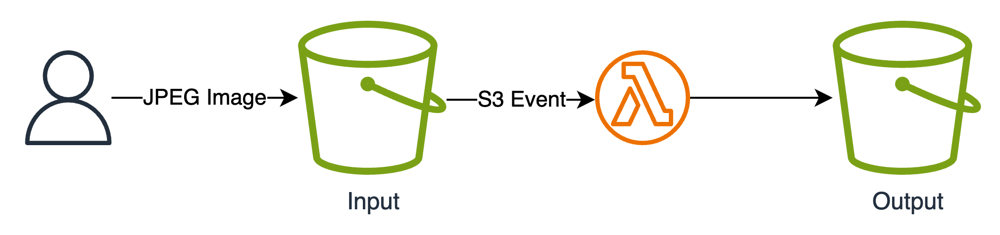

# Image Processor
You are a cloud engineer for a social media platform startup. The company needs a mechanism to process the media assets uploaded by the users.

Users upload high resolution images from their cellphones, but these images are too expensive to work with given their high size. High res images are not absolutely necessary for profile pictures and distribution over small screens.

You are tasked to implement the following design, intended to  process images as they are uploaded, generate the image in different resolutions and store them on a target bucket for future usage by backend micro-services. All the solution should be serverless, as you don't want to spend time managing complete compute instances.

    

1. User uploads image on Input bucket
2. Upon upload, a Lambda function is triggered
3. Lambda takes the new image and generate the following output
    1. Square posts is 1080px by 1080px at a 1:1 aspect ratio.
    2. For landscape posts, use an image that is 1080px by 566px, with an aspect ratio of 1.91:1.
    3. Vertical images should be sized at 1080px by 1350px with a 4:5 aspect ratio.
    4. Choose the most appropriate folder structure and image naming convention to facilitate the organization.
4. When the process is finished, Lambda should add a tag to the original image indicating that it has already been processed.

### Input bucket configuration:

1. High resolution images are stored for 30 days from when they were processed, and deleted after.

### Lambda configuration:

1. Function is triggered upon the upload of an image file into the Input bucket.
2. Python or JS runtime is allowed
